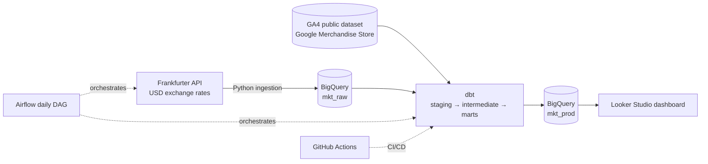
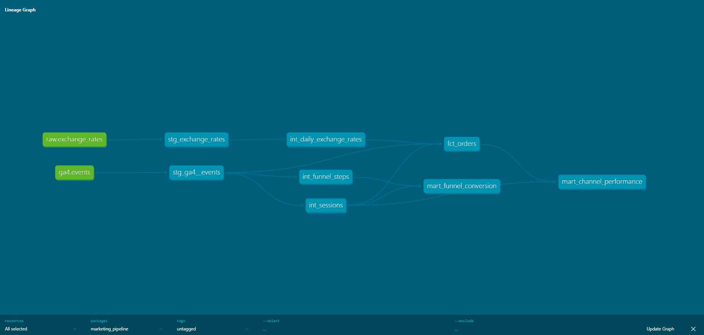
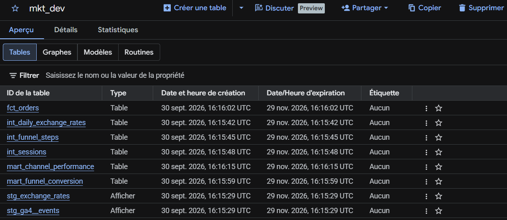
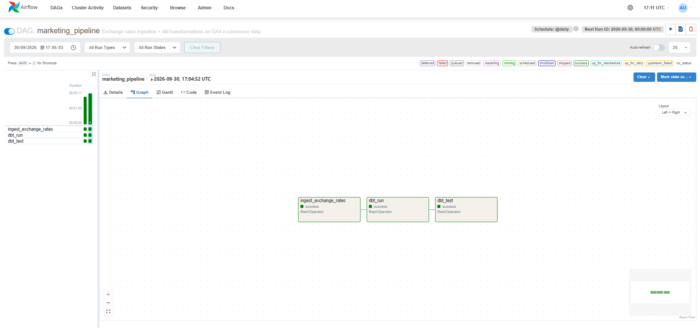

Built by Kenza Qribis — [Portfolio](https://qskenza.github.io)

# Marketing Performance Pipeline

End-to-end data engineering project on Google Cloud: ingest, transform, test, orchestrate
and deploy marketing data for an e-commerce store.


## Business questions

1. Which marketing channels bring the most revenue, and which convert best?
2. Where do users drop off in the purchase funnel (view → cart → checkout → purchase)?
3. How does conversion differ between desktop, mobile and tablet?
4. What is the average order value per channel, in EUR?

## Architecture



## Tech stack

| Layer | Tools |
|---|---|
| Ingestion | Python (requests, pandas), retries + logging, pytest |
| Storage / warehouse | Google BigQuery |
| Transformation | dbt (staging / intermediate / marts, 27 data tests) |
| Orchestration | Apache Airflow (Docker) |
| Packaging | Docker |
| CI/CD | GitHub Actions (lint, tests, dbt build on CI dataset, deploy to prod) |
| BI | Looker Studio |

## Data models

| Model | Description |
|---|---|
| `stg_ga4__events` | One row per GA4 event, nested fields flattened |
| `stg_exchange_rates` | Daily USD → EUR / GBP rates |
| `int_sessions` | One row per session with marketing channel |
| `int_funnel_steps` | Funnel steps reached per session |
| `int_daily_exchange_rates` | Rates for every calendar day (forward-filled) |
| `fct_orders` | One row per order, revenue in USD / EUR / GBP |
| `mart_channel_performance` | Sessions, orders, revenue, conversion per channel |
| `mart_funnel_conversion` | Funnel by channel and device |

## Key insights

Data: Google Merchandise Store, Nov 2020 – Jan 2021.

- **Organic Search is the #1 revenue channel** (~29% of revenue, highest average order value at €60.18), driven by volume rather than efficiency (1.01% conversion).
- **Referral converts best** (1.56%, ~1.5× Organic Search), showing stronger purchase intent from referred visitors.
- **Paid Search underperforms** on every metric: lowest conversion (0.84%), lowest average order value (€47.50), ~2% of revenue. Recommendation: review paid search efficiency and test shifting budget toward referral partnerships.
- **Data quality note:** ~23% of revenue is attributed to "Unknown" sources due to the dataset's anonymization.

## Screenshots

### dbt lineage graph


### BigQuery datasets


### Airflow run


## Run it yourself

Quick start (full guide in [SETUP.md](SETUP.md)):

```bash
pip install -r requirements-dev.txt
python -m ingestion.fetch_rates
cd dbt_project && dbt build --profiles-dir . --target dev
```

Or run everything in Docker, or orchestrate it with Airflow via `docker compose up`.
